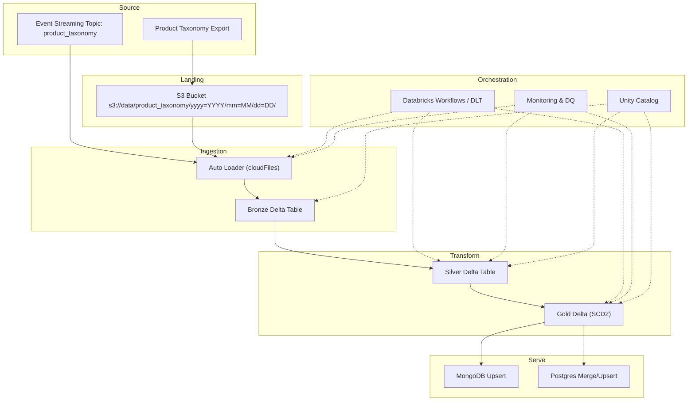

# Product Taxonomy: Daily Ingestion → Processing → MongoDB/Postgres

## High-Level Flow (Process Diagram)


## Detailed Design & Optimizations

### Source → S3 (Landing)

- File format: Prefer Parquet (columnar, compressed) over CSV/JSON for size & speed.
- Partitioned layout:
s3://data/product_taxonomy/yyyy=YYYY/mm=MM/dd=DD/
    
    Add an atomic marker (e.g., _SUCCESS) when the daily drop completes to avoid partial reads.
- File sizing: Emit 128–512 MB files. Avoid many tiny files (object store overhead).
- Naming & idempotency: Include a batch_id in filenames; never overwrite in place.
- Schema contract: Publish a data contract (required columns, types, nullability, enum domains).

### Ingestion (Bronze) with Databricks Auto Loader

- Auto Loader (cloudFiles) for incremental discovery and schema evolution:
    - cloudFiles.maxFilesPerTrigger to control throughput
    - cloudFiles.schemaLocation for evolution history
    - Enable rescue column to capture unexpected fields
- Checkpointing: Isolate checkpoints per pipeline (e.g., /checkpoints/taxonomy/bronze).
- Schema evolution: addColumns only; alert on type widen or breaking changes.
- Quality gates: Basic EXPECT checks (row count > 0, key non-null) at Bronze to fail fast.

### Transform (Silver/Gold)

- De-duplication: Use natural key (e.g., product_id/taxonomy_code) + ingest_ts.
Keep the latest by (key, effective_date) or (key, load_ts).
- Type casting & normalization: trim strings, standardize case, map enums, validate codes.
- SCD strategy:
    - Gold Current: product_taxonomy_current (one active record per key)
    - Gold History: product_taxonomy_history (SCD Type 2; valid_from, valid_to, is_current)
- Performance (Delta):
    - Use Z-ORDER on lookup keys (product_id, parent_id, category_id)
    - Run OPTIMIZE to compact small files; VACUUM with safe retention
    - Photon engine for faster queries
- Data Quality (Silver/Gold):
    - Assertions for uniqueness, referential integrity (parent exists), non-null critical fields
    - Route rejects to quarantine table with reason codes

### Serving to MongoDB

- Connector: MongoDB Spark Connector (or save to Atlas via write config).
- Upsert strategy: Use the taxonomy natural key as _id or a stable unique key.
writeConcern=majority for consistency; ordered=false for throughput.
- Indexes:
    - _id (default)
    - parent_id, category_path, and any frequent query filters
- Batching: Write in micro-batches (5–25k docs) to balance throughput and memory
- TTL: Avoid TTL on core taxonomy; instead, soft-delete or deactivate.

### Serving to Postgres

- Staging + MERGE/UPSERT pattern:
    - Write to staging table (append)
    - MERGE into target with ON (key) updating changed columns, inserting new
    - Vacuum/Analyze staging, truncate after success
- Indexes:
    - PK on natural key
    - Secondary indexes on parent_id, effective_date, category_level
- Load options:
    - Use JDBC batch inserts or COPY (if available via external tool) for speed
- Constraints: Enforce NOT NULL on keys, check constraints for category levels.

### Orchestration & Reliability

- Databricks Workflows / DLT:
    - Retry with exponential backoff (transient S3 throttling, connector hiccups)
    - Failure hooks: notify Slack/Email/PagerDuty with run URL and error summary
    - SLA: e.g., “Available by 06:30 America/Chicago”
- Idempotency:
    - Treat each daily partition as an immutable batch
    - Dedup by (key, batch_id); replays won’t create duplicates
- Backfills:
    - Parameterize --from_date/--to_date
    - Disable serving writes during historical loads, or route to separate staging
- Lineage & Governance (Unity Catalog):
    - Register Bronze/Silver/Gold in UC; enable lineage and grants
    - Mask or tokenize any sensitive attributes (if present)

### Cost & Performance Tuning

- Photon on ETL jobs; i3en/r families or Serverless for price/perf.
- Auto-scaling: Upper bound to avoid runaway cost; spot for Bronze where safe.
- Optimize small files with scheduled OPTIMIZE; keep average 256–512 MB per file.
- Compression: Parquet + zstd (high ratio) or snappy (fast) based on workload.
- Caching: Delta cache for repeated Gold reads (dimension joins downstream).

### Example: Ingestion & Transform (PySpark, simplified)

```python
from pyspark.sql.functions import current_timestamp, col, trim, upper
from delta.tables import DeltaTable

raw_path = "s3://data/product_taxonomy/"
bronze_tbl = "catalog.taxonomy.bronze"
silver_tbl = "catalog.taxonomy.silver"
gold_curr_tbl = "catalog.taxonomy.gold_current"

# BRONZE: Auto Loader
bronze_df = (spark.readStream
  .format("cloudFiles")
  .option("cloudFiles.format", "parquet")
  .option("cloudFiles.schemaLocation", "/mnt/checkpoints/taxonomy/schema")
  .option("cloudFiles.inferColumnTypes", "true")
  .load(raw_path)
  .withColumn("ingest_ts", current_timestamp())
)

(bronze_df.writeStream
  .format("delta")
  .option("checkpointLocation", "/mnt/checkpoints/taxonomy/bronze")
  .outputMode("append")
  .toTable(bronze_tbl)
)

# SILVER: Clean + dedupe (triggered as a separate job)
df = spark.table(bronze_tbl)
clean = (df
  .withColumn("product_id", trim(col("product_id")))
  .withColumn("category", upper(trim(col("category"))))
  .dropDuplicates(["product_id","effective_date"])
)

clean.write.mode("overwrite").saveAsTable(silver_tbl)

# GOLD CURRENT: last version per product_id
from pyspark.sql.window import Window
import pyspark.sql.functions as F

w = Window.partitionBy("product_id").orderBy(F.col("effective_date").desc())
gold_curr = (spark.table(silver_tbl)
  .withColumn("rn", F.row_number().over(w))
  .where("rn = 1")
  .drop("rn")
)

gold_curr.write.mode("overwrite").saveAsTable(gold_curr_tbl)

```

### Example: Write to Postgres (MERGE via staging)

```python
jdbc_url = "jdbc:postgresql://pg-host:5432/catalog"
props = {"user":"svc_loader","password":dbutils.secrets.get("kv","pg_pwd"),"driver":"org.postgresql.Driver"}

staging = spark.table("catalog.taxonomy.pg_staging")
# 1) write staging
staging.write.mode("overwrite").jdbc(jdbc_url, "public.product_taxonomy_staging", properties=props)

# 2) MERGE (execute via JDBC)
merge_sql = """
BEGIN;
MERGE INTO public.product_taxonomy t
USING public.product_taxonomy_staging s
ON (t.product_id = s.product_id)
WHEN MATCHED AND (t.hash <> s.hash) THEN
  UPDATE SET name=s.name, category=s.category, parent_id=s.parent_id, hash=s.hash
WHEN NOT MATCHED THEN
  INSERT (product_id, name, category, parent_id, hash)
  VALUES (s.product_id, s.name, s.category, s.parent_id, s.hash);
TRUNCATE TABLE public.product_taxonomy_staging;
COMMIT;
"""
# Use a small helper to run merge_sql over JDBC (or dbx/psql task in Workflow).

```

### Example: Write to MongoDB (Upsert)

```python
gold = spark.table("catalog.taxonomy.gold_current")

(gold.write
  .format("mongodb")
  .mode("append")
  .option("spark.mongodb.output.uri", "mongodb+srv://cluster/db.product_taxonomy")
  .option("replaceDocument", "true")         # full doc replace
  .option("operationType", "update")         # upsert behavior
  .option("upsertFields", "product_id")      # treat as natural key
  .save())

```

### Runbook (failure quick-checks)

- Late files? Check _SUCCESS marker and Auto Loader file notification log.
- Schema change? Inspect rescue column, update mapping, re-run with addColumns.
- Tiny files? Run OPTIMIZE and review source emit size.
- Duplicate rows? Verify dedupe keys and batch replay policy.
- Mongo/Postgres write failures? Throttle batch size; verify indexes and locks.

<br>

# SCD strategy

<div align="justify">
SCD strategy stands for Slowly Changing Dimension strategy — it’s a data-warehousing technique for handling changes in master or reference data (like product taxonomy, customer, or hierarchy tables) over time without losing history.
<div>

## Here’s the breakdown:

### 🧭 What a “Dimension” Is

<div align="justify">
A dimension table stores descriptive attributes about entities —
e.g., product_id, category_name, parent_category, effective_date, etc.

These attributes change slowly (not every transaction), so you must decide how to capture those changes when they occur.
<div>

### 🧩 Common SCD Strategies (Types)

| **Type**   | **Description**                                            | **Effect**                                              | **Example Use Case**                        |
| ---------- | ---------------------------------------------------------- | ------------------------------------------------------- | ------------------------------------------- |
| **Type 0** | Keep original values; never update                         | Historical data never changes                           | Product launch name frozen forever          |
| **Type 1** | Overwrite with latest value                                | No history maintained                                   | Fixing misspellings or typos                |
| **Type 2** | Keep full history by versioning rows                       | Adds `valid_from`, `valid_to`, `is_current`             | Tracking price category or taxonomy changes |
| **Type 3** | Store limited history (e.g., “previous value”) in same row | Keeps only one prior state                              | Useful for “before vs after” reports        |
| **Type 4** | Maintain separate **history table**                        | Fact table joins only current, history stored elsewhere | High-volume dimensions                      |
| **Type 6** | Hybrid (1 + 2 + 3)                                         | Combines overwrite & historical tracking                | Complex audit needs                         |

### ⚙️ Example – SCD Type 2 (most common in Databricks)

| product_id | category    | valid_from | valid_to   | is_current |
| ---------- | ----------- | ---------- | ---------- | ---------- |
| P100       | Tools       | 2023-01-01 | 2024-03-10 | false      |
| P100       | Power Tools | 2024-03-11 | 9999-12-31 | true       |


➡️ When category changes, the old record’s valid_to is set to yesterday,
and a new version starts from the change date.

### 💡 In Databricks / Delta Lake

**Typically implement SCD 2 using MERGE**:

```sql

MERGE INTO product_taxonomy_history AS target
USING staging_taxonomy AS source
ON target.product_id = source.product_id AND target.is_current = true
WHEN MATCHED AND target.category <> source.category THEN
  UPDATE SET target.valid_to = current_date - 1, target.is_current = false
WHEN NOT MATCHED THEN
  INSERT (product_id, category, valid_from, valid_to, is_current)
  VALUES (source.product_id, source.category, current_date, '9999-12-31', true);

```

### 🧠 Strategy Guidelines

- Use Type 2 for entities whose history matters (taxonomy, hierarchy, pricing).
- Use Type 1 for simple corrections or non-auditable attributes.
- Partition your historical table by effective year/month for query performance.
- Add a current-view table (filtered on is_current = true) for joins with fact data.
- Track changes using hash columns (md5(concat_ws('|', ...))) to detect updates efficiently.