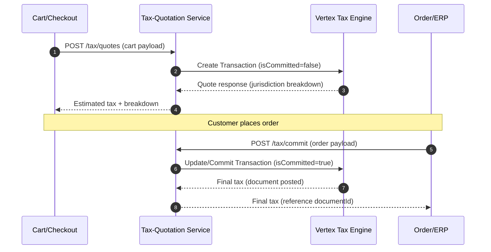
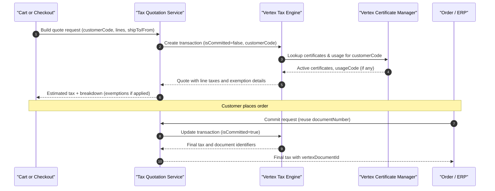
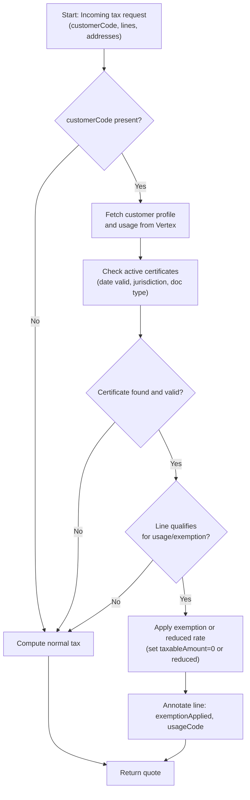

# 📘 Tax Quotation Overview

## Definition

<div align="justify">

A **tax quotation** (also called a *tax quote or tax estimate*) is a preliminary tax computation used to determine how much tax will be applied to a transaction before an order is finalized.

It does not create or post any actual tax liability — its purpose is to display or verify the expected tax amount during quotation, cart, or checkout stages.

<div>

## Factors Considered

A tax quotation typically depends on several parameters:

- Customer location – for calculating applicable sales tax, VAT, or regional tax
- Product or service type – to determine taxable vs. exempt items
- Tax jurisdiction rules – different cities, counties, or states may apply separate rates
- Exemptions or special rates – such as government, non-profit, or resale exemptions
- Transaction date/time – tax rates may vary over time or based on effective dates

## Purpose and Usage

Tax quotations are primarily used to:

- Display estimated taxes in the shopping cart or quote summary
- Provide accurate tax previews before finalizing an order
- Support customer transparency in pricing and compliance
- Enable systems to validate tax rules without recording actual liabilities

## Example Use Case

**Input Request Example (internal tax-quotation API)**:

```json
{
  "customerLocation": {
    "country": "US",
    "state": "IL",
    "postalCode": "60601",
    "city": "Chicago",
    "addressLine1": "123 N Example St"
  },
  "shipFrom": {
    "country": "US",
    "state": "IL",
    "postalCode": "60173"
  },
  "customer": {
    "customerCode": "ACME-001",
    "exemptionCode": null
  },
  "transactionDate": "2025-11-02",
  "currencyCode": "USD",
  "lines": [
    { "lineId": "1", "sku": "12345", "description": "Widget", "price": 100.00, "quantity": 2, "uom": "EA", "productClass": "LEAFNODE" }
  ]
}
```

**Sample Tax Quotation Response**:

```json

{
  "quoteId": "Q-5b8df7",
  "totalTax": 14.00,
  "effectiveRate": 0.07,
  "jurisdictions": [
    { "level": "STATE", "name": "IL", "rate": 0.05, "tax": 10.00 },
    { "level": "COUNTY", "name": "Cook", "rate": 0.02, "tax": 4.00 }
  ],
  "lineTaxes": [
    { "lineId": "1", "taxableAmount": 200.00, "tax": 14.00, "rate": 0.07 }
  ],
  "isCommitted": false
}
```

## Comparison: Tax Quotation vs. Tax Calculation (Final)
| **Aspect**            | **Tax Quotation**           | **Tax Calculation (Final)**           |
| --------------------- | --------------------------- | ------------------------------------- |
| **Purpose**           | Estimate/preview of taxes   | Final computation for invoice/payment |
| **Timing**            | Before checkout/payment     | During order creation or invoicing    |
| **Accounting Impact** | None                        | Tax liability is recorded             |
| **Used By**           | Carts, quotes, draft orders | Invoicing, billing, payment services  |
| **Engine Flag**       | Non-committed               | Committed/postable                    |


## 🔌 Vertex Integration

This section describes how the tax-quotation service integrates with Vertex to obtain estimates (non-committed) and final calculations (committed).

### High-Level Flow (Quotation → Commit)



**Key idea: Quotation** uses isCommitted=false (no liability posted). **Finalization** uses isCommitted=true (document posted/committed). The same transaction/document identifier should be reused to avoid recomputation drift and ensure auditability.

## Vertex Terminology & Mapping

| **Your Domain**        | **Vertex Concept**                     | **Notes**                                                   |
| ---------------------- | -------------------------------------- | ----------------------------------------------------------- |
| Quote (Cart)           | Non-committed transaction              | Often created with a unique `documentNumber` (e.g., cartId) |
| Final Invoice/Order    | Committed (posted) transaction         | Same `documentNumber`, `isCommitted=true`                   |
| Customer               | `customerCode`                         | Used for exemptions/certificates/usage codes                |
| Product class/tax code | `productClass` / `taxabilityCategory` / ` leafNode`  | Map SKUs → Vertex taxability categories                     |
| Ship-from              | `seller` or `origin`                   | Needed for origin-based rules                               |
| Ship-to                | `destination`                          | Needed for destination-based rules                          |
| Exemption              | `exemptionCode` or certificate on file | Drive non-taxable or reduced rate                           |
| Jurisdiction breakdown | Lines for state/county/city/special    | Returned per line and summary                               |

**Keep a stable** documentNumber per cart/order to make commit idempotent and auditable.

### Request/Response Contract (Illustrative)
**A) Quotation (isCommitted=false)**

**TQS → Vertex (simplified)**

```json

{
  "documentNumber": "CART-0728983909",
  "documentDate": "2025-11-02",
  "customerCode": "ACME-001",
  "currencyCode": "USD",
  "isCommitted": false,
  "seller": {
    "country": "US",
    "state": "IL",
    "postalCode": "60173"
  },
  "destination": {
    "country": "US",
    "state": "IL",
    "postalCode": "60601",
    "city": "Chicago",
    "street1": "123 N Example St"
  },
  "lines": [
    {
      "lineId": "1",
      "productCode": "12345",
      "productClass": "leafNode_id",
      "quantity": 2,
      "unitPrice": 100.00,
      "extendedPrice": 200.00,
      "uom": "EA",
      "description": "Widget"
    }
  ]
}
```

**Vertex → TQS (simplified)**

```json

{
  "documentNumber": "CART-0728983909",
  "totalTax": 14.00,
  "lines": [
    {
      "lineId": "1",
      "tax": 14.00,
      "taxableAmount": 200.00,
      "effectiveRate": 0.07,
      "jurisdictions": [
        { "level": "STATE", "name": "IL", "rate": 0.05, "tax": 10.00 },
        { "level": "COUNTY", "name": "Cook", "rate": 0.02, "tax": 4.00 }
      ]
    }
  ]
}
```

**TQS then normalizes this into the Tax Quotation Response shown earlier.**

**B) Final Calculation / Commit (isCommitted=true)**

**Order/ERP → TQS**

```json

{
  "orderId": "ORD-900123",
  "documentNumber": "CART-0728983909",
  "transactionDate": "2025-11-02",
  "lines": [
    { "lineId": "1", "sku": "12345", "quantity": 2, "unitPrice": 100.00 }
  ],
  "charges": [
    { "type": "FREIGHT", "amount": 10.98 }
  ]
}

```

**TQS → Vertex**

- Reuse documentNumber
- Add freight and any surcharges as separate lines or Freight flags
- Set isCommitted=true

**Vertex → TQS**
- Returns final taxes and document identifiers suitable for audit/export.

## Idempotency & Drift Control

- Document number = cartId/orderId (or a deterministic mapping).
- On commit, update the existing non-committed transaction instead of creating a brand new one.
- Persist the Vertex document key (e.g., vertexDocumentId) on your order.
- If commit is retried, use idempotency keys and safe “get or commit” logic:
    - If already committed, fetch and return the committed totals.
    - If still non-committed, commit it.
- Log rate versions or effective dates to explain any differences between quote and final.

## Performance & Resilience

- Batching: Quote multiple lines in a single call; include freight as a separate line if needed.
- Latency budget: Set timeouts (e.g., 500–1500 ms) with retry + exponential backoff for transient 5xx.
- Graceful degradation:
    - If Vertex is down for quotation, allow checkout to proceed with last-known rate or zero tax per business policy, but block commit until a successful final calc.
    - Feature flags to toggle fallback behavior.
- Caching:
    - Short-lived cache for unchanged cart quotes (keyed by cart hash
    - Do not cache committed responses beyond audit export needs.

## Tax Data Shaping

- Product→Tax code mapping: Maintain a reference table from SKU/category to Vertex taxability category (productClass/taxCode).
- Freight/handling: Decide line vs. attribute; many teams model these as separate taxable lines.
- Discounts: Prefer line-level net pricing to avoid ambiguous allocations, or pass a discount field if supported.
- Exemptions:
    - Use customerCode + exemptionCode (or certificate on file).
    - For entity/use-based exemptions, set the proper use code on the transaction or line.
- Nexus:
    - Ensure Vertex/company settings reflect where you collect tax; your seller location and company config must match.

## Observability & Audit

- Log (PII-safe) request/response summaries with:
    - documentNumber, isCommitted, totalTax, jurisdiction counts, timing, result code.
- Metrics:
    - vertex.quote.latency_ms, vertex.commit.latency_ms
    - Success/error rates by errorCategory (4xx config vs 5xx transient)
    - Drift metric: finalTax - quotedTax
- Traceability:
    - Include a traceId across Cart → TQS → Vertex → Order.
- Exports:
    - Store vertexDocumentId/keys for later reconciliation.

## Errors & Fallbacks

| **Category**             | **Examples**                          | **Action**                                                                                   |
| ------------------------ | ------------------------------------- | -------------------------------------------------------------------------------------------- |
| Validation (4xx)         | Missing address, invalid product code | Return 400 to caller with actionable message                                                 |
| Config (4xx)             | Unknown tax code, no nexus            | Flag to tax ops; allow quote fallback per policy                                             |
| Transient (5xx/timeouts) | Vertex outage, network blip           | Retry with backoff; fallback to cached or zero tax for quote; **block commit** until success |
| Commit conflicts         | Already committed                     | Fetch committed doc & return it (idempotent)                                                 |

## Security

- Use mTLS or HTTPS with API keys/OAuth per your Vertex deployment.
- Do not log full addresses or PII; mask on logs/dashboards.
- Encrypt credentials/secrets; rotate regularly (Vault/KMS).

## Configuration (12-Factor Friendly)

- VERTEX_BASE_URL
- VERTEX_API_KEY / OAuth credentials
- VERTEX_COMPANY_CODE (if applicable)
- TAX_TIMEOUT_MS (quote/commit)
- TAX_RETRY_MAX_ATTEMPTS, TAX_RETRY_BACKOFF_MS
- TAX_FALLBACK_MODE (NONE | LAST_KNOWN_RATE | ZERO_TAX_FOR_QUOTE)
- ENABLE_VERTEX_COMMIT (feature flag)
- PRODUCT_TAX_CODE_SOURCE (DB/table/version)

## Testing Checklist

- Unit: Mapping (cart → Vertex), exemptions, freight, discounts.
- Contract: JSON schema for request/response; unknown fields ignored.
- Integration (sandbox):
    - Quotation round-trip with typical addresses.
    - Commit idempotency & retry.
    - Drift scenarios (rate change between quote and commit).
    - Exemption (full and partial) cases.
- Negative: Missing address, unknown product tax code, no nexus.
- Performance: Max line counts, cold start, P95 latency budget.
- Security: No secrets in logs; PII masking.

## Example: Internal API Shapes

**POST /tax/quotes (request)**
```json
{
  "cartId": "0728983909",
  "transactionDate": "2025-11-02",
  "customer": { "customerCode": "ACME-001", "exemptionCode": null },
  "shipFrom": { "country": "US", "state": "IL", "postalCode": "60173" },
  "shipTo":   { "country": "US", "state": "IL", "postalCode": "60601" },
  "currencyCode": "USD",
  "lines": [
    { "lineId": "1", "sku": "12345", "productClass": "TOOLS", "quantity": 2, "unitPrice": 100.00 }
  ],
  "charges": [
    { "type": "FREIGHT", "amount": 10.98 }
  ]
}
```

**POST /tax/quotes (response)**
```json
{
  "quoteId": "Q-5b8df7",
  "cartId": "0728983909",
  "totalTax": 14.77,
  "effectiveRate": 0.0671,
  "jurisdictions": [
    { "level": "STATE", "name": "IL", "rate": 0.05, "tax": 11.00 },
    { "level": "COUNTY", "name": "Cook", "rate": 0.0171, "tax": 3.77 }
  ],
  "lineTaxes": [
    { "lineId": "1", "taxableAmount": 200.00, "tax": 13.42, "rate": 0.0671 }
  ],
  "surchargeTaxes": [
    { "type": "FREIGHT", "taxableAmount": 10.98, "tax": 0.74, "rate": 0.0671 }
  ],
  "isCommitted": false,
  "engineRef": { "documentNumber": "CART-0728983909" }
}
```

## Rollout Strategy

- Dark launch quotation (non-blocking): Compare against legacy totals.
- Alerting on drift > threshold (e.g., >$1 or >0.5%).
- Progressive enablement by traffic percentage/tenant.
- Commit enablement after quotation stabilizes.
- Runbooks for outages & fallbacks.

<br><br>

# 🧾 What Are Tax Certificates?

<div align="justify">

A **tax exemption certificate** is an official document that proves a customer is not required to pay sales tax (either partially or fully) for certain transactions.
These are issued and maintained by government agencies, but validated, stored, and referenced by systems like Vertex or Avalara to ensure compliance.

<div>

## Common examples include:

| **Exemption Type**                    | **Description**                                   | **Example**                  |
| ------------------------------------- | ------------------------------------------------- | ---------------------------- |
| **Resale Certificate**                | Business buying goods for resale, not for end use | Retailer buying inventory    |
| **Government Exemption**              | Purchases made by federal or state agencies       | Government procurement       |
| **Nonprofit/Charitable Organization** | Certain nonprofits may be exempt                  | Hospitals, schools, churches |
| **Manufacturing/Industrial Use**      | Raw materials for production may be exempt        | Factory buying steel sheets  |
| **Agricultural Use**                  | Farm-related goods                                | Farm equipment, fertilizer   |


## 🧩 Role of customerCode in Vertex

<div align="justify">
In Vertex, customerCode uniquely identifies the customer entity in your ERP, e-commerce, or order management system.

Think of it as a key that links to tax profiles and exemption certificates stored within Vertex or an external database.
<div>

**Example**
```json
"customer": {
  "customerCode": "ACME-001",
  "exemptionCode": null
}
```

When customerCode = "ACME-001", Vertex checks its database for:
- Associated tax region or jurisdiction
- Any active exemption certificates
- Usage codes that define the type of exemption (e.g., resale, manufacturing)
- Default taxability profile (e.g., B2B, government)

**If a valid certificate exists for that customer, Vertex will automatically apply a non-taxable or reduced rate for applicable products.**

## 🧠 How It Works in Practice

1. **Customer Profile Setup**
    - You create or sync a customer profile in Vertex (either manually or via API).
    - The profile includes customerCode, address, exemption info, and usage category.

**Example in Vertex setup**:

| Field                 | Example                  |
| --------------------- | ------------------------ |
| Customer Code         | ACME-001                 |
| Name                  | ACME Industrial Supplies |
| Type                  | Business                 |
| Usage Code            | RESALE                   |
| Exemption Certificate | CERT-98765               |
| Effective Dates       | 2025-01-01 to 2026-12-31 |

<br>

2. **During Tax Quotation**

**When Tax Quotation Service calls Vertex**:

```json

{
  "documentNumber": "CART-0728983909",
  "customerCode": "ACME-001",
  "isCommitted": false,
  "lines": [
    { "sku": "12345", "price": 100.00, "quantity": 1 }
  ]
}
```

**Vertex evaluates**:
- Is customerCode known?
- Is there a valid exemption certificate on file?
- Does the usage code apply to this product or transaction?

If yes, the line’s taxable amount is reduced or zeroed.
<br>

3. **Exemption Application Example**

**Without Exemption**

```json

"lineTaxes": [
  { "lineId": "1", "taxableAmount": 100.00, "tax": 7.00 }
]

```
**With Exemption Certificate**

```json

"lineTaxes": [
  { "lineId": "1", "taxableAmount": 100.00, "tax": 0.00, "exemptionApplied": "CERT-98765" }
]
```

## 🧩 exemptionCode vs usageCode

| Field               | Purpose                                                                                   | Example        |
| ------------------- | ----------------------------------------------------------------------------------------- | -------------- |
| **`exemptionCode`** | Identifier of a specific certificate stored in Vertex or your system                      | `"CERT-98765"` |
| **`usageCode`**     | A code that defines *why* the exemption applies (e.g., resale, government, manufacturing) | `"RESALE"`     |
| **`customerCode`**  | Unique customer reference used to look up exemptions, nexus, and profile                  | `"ACME-001"`   |

**Often, usageCode is configured in the Vertex UI and applied automatically based on the customer profile.
If no exemption applies, tax is computed normally.**

## 🧰 Best Practices for Implementation

- Always send a consistent customerCode from your system of record (ERP, CRM, or e-commerce platform).
- Synchronize exemptions from your CRM or tax ops system to Vertex daily.
- Include exemptionCode only when the exemption applies to that specific transaction.
- Validate that the certificate’s effective date range covers the transaction date.
- For B2C (consumer) transactions, customerCode may be optional or generic (e.g., "GUEST").
- Implement a fallback flow:
    - If Vertex returns an invalid or expired exemption, display a user-friendly message like “Tax exemption expired; full tax applied.”

## 🧮 Summary

| Concept             | Purpose                                    | Maintained In                      | Used During                  |
| ------------------- | ------------------------------------------ | ---------------------------------- | ---------------------------- |
| **Tax Certificate** | Proof of exemption from sales tax          | Tax engine (Vertex) or internal DB | Tax quotation & final commit |
| **Customer Code**   | Unique identifier for customer tax profile | ERP / Vertex                       | Every tax call               |
| **Exemption Code**  | Specific certificate ID                    | Vertex                             | If applicable                |
| **Usage Code**      | Type/category of exemption                 | Vertex                             | Auto-applied via profile     |

<br>

### Sequence: customerCode → exemption/usage lookup → quote → commit**

<br>



<br>

### Flowchart: how exemptions are decided for a line

<br>

